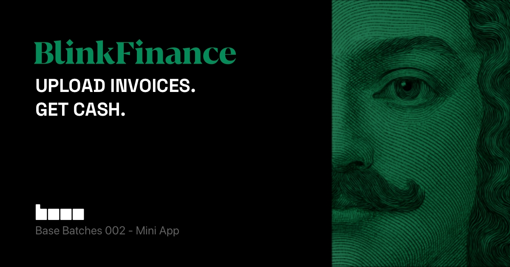

This is a [Next.js](https://nextjs.org) project bootstrapped with [`create-onchain`](https://www.npmjs.com/package/create-onchain).


## Getting Started

First, install dependencies:

```bash
npm install
```

Next, run the development server:

```bash
npm run dev
```

Open [http://localhost:3000](http://localhost:3000) with your browser to see the result.


